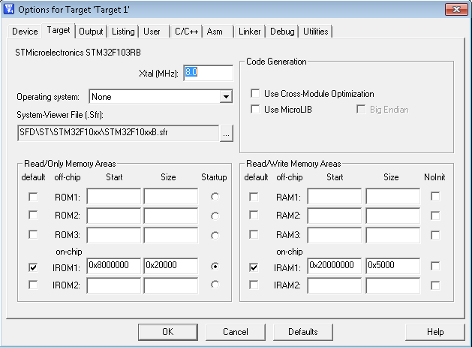
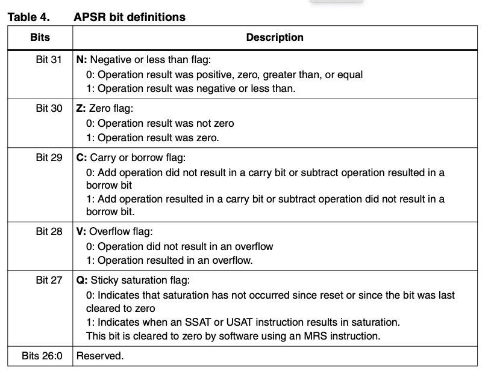

## ENSE 352 - Fundamentals of Computer Systems Architectures - Laboratory

# Lab 1: Introduction to ARM and tools

### University of Regina
### Faculty of Engineering and Applied Science - Software Systems Engineering

### Lab Instructor: [Trevor Douglas](mailto:trevor.douglas@uregina.ca)

## Introduction

Introduce the students to some of the ARM architecture. Begin using the lab tools. The students will create a project and write an assembly program based on a simulated target.

## Background

### ARM Processor


- The Cortex-M3 processor is a high performance 32-bit processor designed for the microcontroller market. 
- Outstanding processing performance combined with fast interrupt handling
- Enhanced system debug with extensive breakpoint and trace capabilities.
- Efficient processor core, system and memories
- Ultra-low power consumption with integrated sleep mode and an optional deep sleep mode.


### Our Board - Nucleo-F103RB

<table>
  <tr>
    <td>
        <li>ARM 32 Bit Cortex-M3 Core</li>
        <li>Contoller - STM32F103RB</li>
        <li>72MHz Clock</li>
        <li>128kB Flash</li>
        <li>16kB SRAM</li>
        <li>Documentation available on the GitHub site</li>
    </td>
    <td> </td>
  </tr>
</table>


### Block Diagram
<table>
  <tr>
    <td> </td>
  </tr>
</table>


### Registers
<table>
  <tr>
    <td> </td>
  </tr>
</table>


### Memory Map
<table>
  <tr>
    <td> </td>
  </tr>
</table>

### Initial Code

<details>
<summary>expand startup.s</summary>

in `startup.s`

```assembly

Code  Snippet

;This initial location is the first location of Flash
__Vectors   DCD	0x20002000		; stack pointer
            DCD	Reset_Handler		; reset vector
     
    ALIGN ; Make the next code 32 bit aligned.

;My  program,  Linker requires Reset_Handler and it must be exported

    AREA    MYCODE, CODE, READONLY
        
    ENTRY
    EXPORT	Reset_Handler

; First line of actual code
Reset_Handler
    MOV		R0, #0x76

```
</details>

#### Stack pointer

The Stack Pointer (SP) is register R13. 

On reset, the processor loads the MSP with the value from address 0x00000000.


#### Program counter

The Program Counter (PC) is register R15. It contains the current program address. Bit[0] is always 0 because instruction fetches must be halfword aligned. On reset, the processor loads the PC with the value of the reset vector, which is at address 0x00000004.


#### Project Options
<table>
  <tr>
    <td> </td>
  </tr>
</table>

Notice that the ROM or Flash in our case is at 0x8000000 and the RAM is at 0x20000000.


#### Application Program Status Register

The APSR contains the current state of the condition flags from previous instruction executions. The bit assignments are:
<table>
  <tr>
    <td> </td>
  </tr>
</table>

#### Example instructions

<details>
<summary>expand example.s</summary>

in `example.s`

```assembly

label

  ;Move Data
  MOV	Ry, #0x76         ; Move a 8 bit Hex number to low word of Ry
  MOV	Ry, #0x7654       ; Move a 16 bit Hex number to low word of Ry
  MOVT	Ry, #0x7654     ; Move a 16 bit Hex number to high word of Ry
  MOV32	Ry, #0x76543210 ; Move the 32 bit Hex number to Ry
  MOV   Rx, Ry          ; Move Ry to Rx							

  ;Store Data. LDR allows to move 32 bits of data
  LDR	Ry, = 0x76543210  ;Load Ry with the 32 bit Hex number 76543210

  ;Arithmetic operations
  ADD	Rx,Ry,Rz    ; Add contents of Ry and Rz, store result in Rx
  ADDS	Rx,Ry,Rz  ; Same…but there is a difference. What is it?	

  ;Branching
  B	label   		; Branch to  label


```
</details>

#### Things to Note
- The x,y,z in Rx, Ry, Rz are placeholders!  You may use any general purpose registers.
- The MOV instruction copied data from register to register of from an immediate value.
- LDR is termed pseudo instruction.  This loads a 32 bit value into any register.
- Labes must be along the left margin and assembly code must be 1 tab in.
- Quick reference document available in the Resource folder on  URCourses.