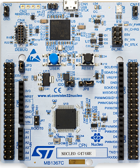
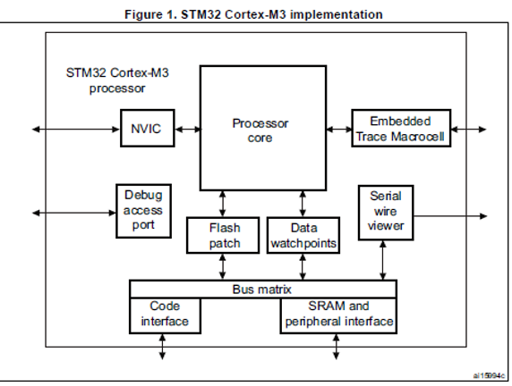
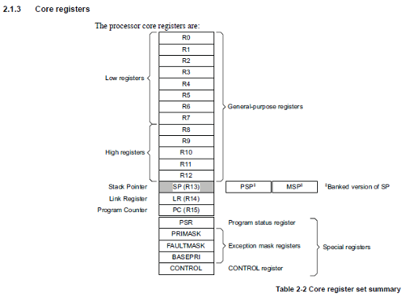
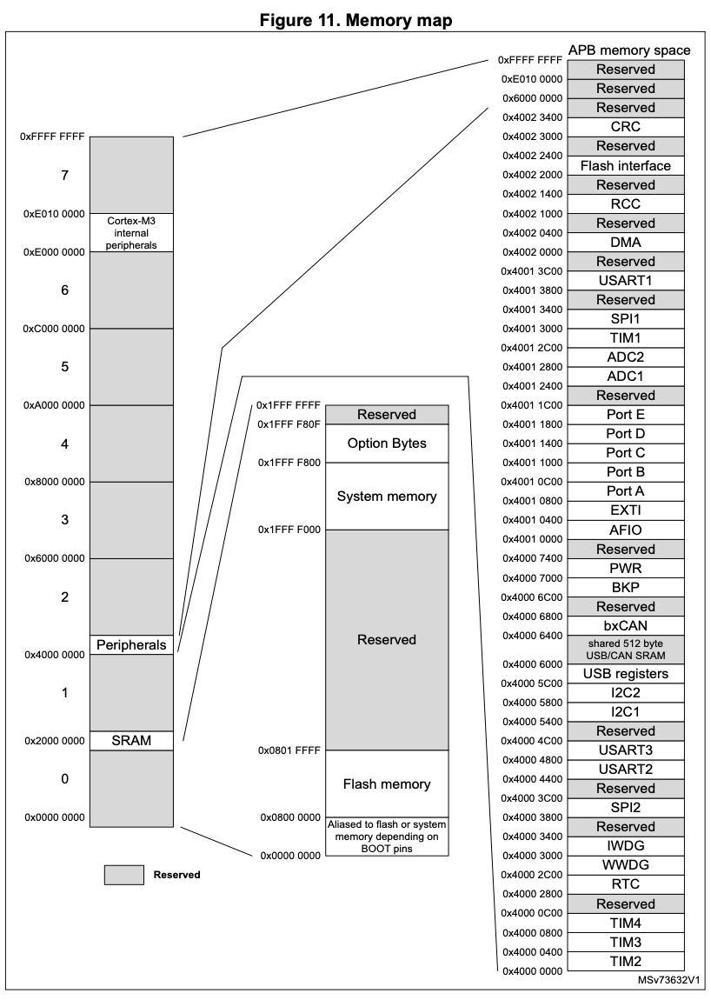

## ENSE 352 - Fundamentals of Computer Systems Architectures - Laboratory

# Lab 1: Introduction to ARM and tools

### University of Regina
### Faculty of Engineering and Applied Science - Software Systems Engineering

### Lab Instructor: [Trevor Douglas](mailto:trevor.douglas@uregina.ca)

## Introduction

Introduce the students to some of the ARM architecture. Begin using the lab tools. The students will create a project and write an assembly program based on a simulated target.

## Background

### ARM Processor


- The Cortex-M3 processor is a high performance 32-bit processor designed for the microcontroller market. 
- Outstanding processing performance combined with fast interrupt handling
- Enhanced system debug with extensive breakpoint and trace capabilities.
- Efficient processor core, system and memories
- Ultra-low power consumption with integrated sleep mode and an optional deep sleep mode.


### Our Board - Nucleo-F103RB

<table>
  <tr>
    <td>
        <li>ARM 32 Bit Cortex-M3 Core</li>
        <li>Contoller - STM32F103RB</li>
        <li>72MHz Clock</li>
        <li>128kB Flash</li>
        <li>16kB SRAM</li>
        <li>Documentation available on the GitHub site</li>
    </td>
    <td> </td>
  </tr>
</table>


### Block Diagram
<table>
  <tr>
    <td> </td>
  </tr>
</table>


### Registers
<table>
  <tr>
    <td> </td>
  </tr>
</table>


### Memory Map
<table>
  <tr>
    <td> </td>
  </tr>
</table>

### Initial Code

<details>
<summary>expand startup.asm</summary>

in `startup.asm`

```assembly

Code  Snippet

;This initial location is the first location of Flash
__Vectors   DCD	0x20002000		; stack pointer
            DCD	Reset_Handler		; reset vector
     
    ALIGN

;My  program,  Linker requires Reset_Handler and it must be exported

    AREA    MYCODE, CODE, READONLY
        
    ENTRY
    EXPORT	Reset_Handler

; First line of actual code
Reset_Handler
    MOV		R0, #0x76

```


</details>

<details>
<summary>expand main.dart</summary>

in `main.dart`

```dart
import 'package:flutter/material.dart';
import 'bmi.dart';

void main() {
   runApp(MyApp());
}

class MyApp extends StatelessWidget {
  @override
  Widget build(BuildContext context) {
    return MaterialApp(
    );
  }
}


```

</details>