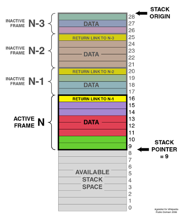
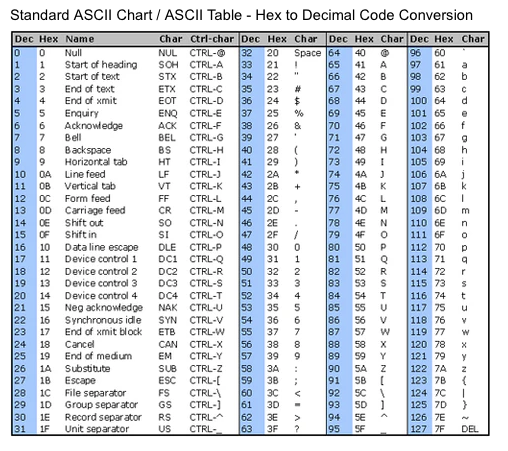

## ENSE 352 - Fundamentals of Computer Systems Architectures - Laboratory

# Lab 2: Control Flow Statements 

### University of Regina
### Faculty of Engineering and Applied Science - Software Systems Engineering

### Lab Instructor: [Trevor Douglas](mailto:trevor.douglas@uregina.ca)

## Objective

The objective of this lab is to introduce the students to ARM assembly using control flow statements and instructions.

## Background

### Program Counter - R15

- The Program Counter is a register that contains the address of the current instruction.
- During normal logical flow the Program Counter increments according to the instructions implemented in order.
- After a branch or subroutine call the Program Counter will contain the “jumped to “ address.
- You are able to access this register from your code by using R15 or PC.


### The Stack

- Remember the stack pointer (R13) points to the top of stack.
- A typical stack is an area of computer memory with a fixed origin and a variable size. 
- A stack pointer, usually in the form of a hardware register, points to the most recently referenced location on the stack
- A stack is used to hold information as your program runs.  
 
 It is also used to:
 - Keep track of where you were during a branch or sub routine call.
 - Pass parameters to subroutines. 
 - Anything you would like saved.

The two operations applicable to all stacks are:
- a push operation, in which a data item is placed at the location pointed to by the stack pointer, and the address in the stack pointer is adjusted by the size of the data item.  Push {R1},  or Push{R1,R2,R3}
- a pop or pull operation: a data item at the current location pointed to by the stack pointer is removed, and the stack pointer is adjusted by the size of the data item. Pop {R1}, or Pop{R1,R2,R3}

### Sample Stack
<table>
  <tr>
    <td> </td>
  </tr>
</table>

### Looping example

<details>
<summary>expand loop.s</summary>

in `loop.s`

```assembly

  MOV  R0, #0    ;initialize R0 as our counter

  ;Start of the loop
Start
  
  ; Stuff you may want to do in your loop

  
  ADD   R0, #1      ; Increment the counter
  CMP   R0, #16     ; How many times to loop
  BNE    Start      ; Loop back if not done


  ;What about checking R0 being zero or not zero using the Z flag:


  CBZ	R0, loopZero
  ;; or
  CBNZ	R0, loopNotZero

```
</details>

### Link Register R14 and Subroutines

The link register is used to store the return program counter  when a subroutine or function is called.  To Branch (or call) a subroutine using the Branch and update Link Register.

```assembly
  BL function   ; Branch to a subroutine and place the return address in the Link Register.
                ; The Link Register will contain the address of the code after the Branch
                ; instruction.


function        ; This is the label or name of the subroutine.

  BX LR         ; Branch back to the Link Register address.


  ;Another alternative to a subroutine call

  ALIGN   ; Make sure we are on a 32 bit boundary

Delay	PROC            ; Delay is the name of the subroutine
  
  push	{R1,LR}   	  ; Push R1 and LR onto the stack
  MOV 	R1,#4         ; Initialize a counter

delay_loop            ; This is a loop ... NOT a SUBROUTINE
  
  subs	R1, #1        ; Decrement the counter
  bne	delay_loop
  
  pop	{R1,PC}	        ; I am dond, Pop off the stack into R1 and PC 
                      ; (PC will get the LR)
      
  ENDP                ; End the procedure


```

### My favorite way to call and write subroutines

``` assembly

  ; Setup any registers you want as inputs into the subroutine
  ;Call the routine like this
  BL  Delay


  ; Put the name of the subroutine here
  ; Indicate any inputs you are using
  ALIGN

Delay	PROC           ; Delay is the name of the subroutine.
  
  PUSH R1            ; I am using R1 so I should push it to the stack.  
  MOV 	R1,#4

delay_loop
  SUBS	R1, #1
  BNE	delay_loop
  
  POP R1
  BX  LR	

      
  ENDP

```

### Creating C Strings

This type of format will construct a C string and null terminate.  This means you can tell when the string ends.

``` assembly

String1                         ; This is the label of the string in memory.
  DCB	"ENSE 352 is fun!!!“,0    ; Dedicate some data nad NULL terminate.

```

Place this String Directive somewhere in your code that your PC will not address. In order to  access this string we can load the memory address where it is stored like so:

``` assembly
  LDR		R0, = String1   ;R0 now contains the address for the string

```

### Memory Access Instructions

How to transfer data from memory into a register.


_op{type}{cond} Rt, [Rn {, #offset}]_ ; Immediate offset

where:
- ‘op’ is either LDR (load register) or STR (store register)
- ‘type’ is one of the following:
- B: Unsigned byte, zero extends to 32 bits on loads
- SB: Signed byte, sign extends to 32 bits (LDR only)
- H: Unsigned halfword, zero extends to 32 bits on loads
- SH: Signed halfword, sign extends to 32 bits (LDR only)
- ‘cond’ is an optional condition code (see Conditional execution on page 58)
- ‘Rt’ is the register to load or store
- ‘Rn’ is the register on which the memory address is based‘offset’ is an offset from Rn. If offset is omitted, the address is the contents of Rn


### Memory Access Instructions code

How to transfer on byte of data from memory into a register.

``` assembly 
String1
  DCB	"ENSE 352 is fun!!!“,0   ;  This 0 indicates null terminate

  ;In order to  access this string we can load the memory address where it is stored like so:

  LDR		R0, = String1

  ;R0 now contains the address for the string

  LDRB		R1,[R0]   ;This will load one byte of data ... An 'E' !

```

### Ascii Code

Remember that when you are looking at characters or a string, they are represented by ASCII Code. So an ‘a’ is represented by 97 decimal or hexadecimal 0x61.

<table>
  <tr>
    <td> </td>
  </tr>
</table>

So if we wanted to check if a certain character was in a register

``` assembly
  CMP		R1, #’a’
  BEQ 		vowelDetected

```
And

``` assembly

  CMP		R1, #0x61
  BEQ		vowelDetected

```

Are equivalent.

## Sample code to try.

<details>
<summary>expand sample.s</summary>

in `sample.s`

``` assembly
; Put your name and a title for the program here

;;; Directives
            PRESERVE8
            THUMB  
			
			
;;; Equates

INITIAL_MSP	EQU		0x20001000	; Initial Main Stack Pointer Value	Allocating 
								; 1000 bytes to the stack as it grows down.
			     
								    
; Vector Table Mapped to Address 0 at Reset
; Linker requires __Vectors to be exported

      AREA    RESET, DATA, READONLY
      EXPORT  __Vectors

__Vectors	DCD		INITIAL_MSP			; stack pointer value when stack is empty
        	DCD		Reset_Handler		; reset vector
	 		
	ALIGN

;The program
; Linker requires Reset_Handler

  AREA    MYCODE, CODE, READONLY


	ENTRY
	EXPORT	Reset_Handler

	ALIGN
			
Reset_Handler	PROC
                                

  MOV R0, #0x3355
	PUSH {R0}  			; Notice the stack at 0x200000FF8  (Contains R1 then LR ) Little endian
	MOV32 r0, #0xDEADBEEF
	PUSH {R0}
	POP {R4}

	MOV R0, #0x00
Loop

	ADD	R0, #1
	CMP	R0, #4
	BNE	Loop

Start

	MOV R0, #9	;; Just an extra line

  BL function1
	
	MOV R0, #9	;; Another extra line
		
	BL function2

		

	LDR		R0, = string1       ;Loading the address of string1 into the R0 address
		
  BL  vowelCount
		
	B Start
	ENDP         


	ALIGN
function1  PROC

		;;This is the guts of the subroutine
		
	BX LR

	ENDP


	ALIGN
function2	PROC ;Using this PROC and ENDP like curly braces 
	PUSH 	{R1,LR}	  
	MOV		R1,#4
		
delay
	SUBS	R1, #1
	BNE		delay

	POP		{R1,PC}


	ENDP

	ALIGN
string1
			DCB		"ENSE 352 is fun and I am learning ARM assembly!",0


;Input : R0  - This contains the address of the beginning of a char array

	ALIGN
vowelCount  PROC
	PUSH {R1}
	LDRB	R1,[R0]
		
		
	POP {R1}
	BX LR

  ENDP

	END

```

## Assignment

We have been introduced to a number of new assembly instructions:

- BL - Branch with Link (Call a subroutine) and store the return address in the LR 2. B - Branch
- BX LR - Return from a subroutine.
- PUSH Reg.. - Push multiple Registers to the stack
- POP Reg.. - Pop multiple Registers from the stack.
- LDR Rt, label - Load register from memory LDR, PC-relative


### Phase 1

- From last week, start a project.
- Load any three general purpose registers with 0x00001111 and 0x00002222 and 0x00003333. Push these values to the stack one at a time using the PUSH command. Observe the stackpointer as you do this. Is the stack pointer going up or down?
- Open a memory window under View ->. Open the location that the Stack Pointer is at. Look at the memory values and how they contrast to the register values.
- Pop these registers off the stack and observe the Stack Pointer.
- Repeat the process but use multiple PUSH and POP’s on one line.


### Phase2

Now continue to build your program that has the following features:
- Store an integer in a register.
- Create a subroutine that will calculate the factorial of this integer and store it in a register. After returning from this subroutine, demonstrate you have calculated the factorial by debugging and investigate the register.

### Phase3

Now continue to build your program that has the following features:
- Store two strings ”ENSE 352 is fun and I am learning ARM assembly!” and ”Yes I really love it!”
- Your program will count the vowels of these two strings and store that count in a register that is available in the main part of your program.
- Your program shall have a subroutine named countVowels.
- Your program shall count both upper case and lower case vowels as the same vowel.

### Submission
Submit your *.s file to URCourses by your due date.  Be prepared to also demonstrate your submission.