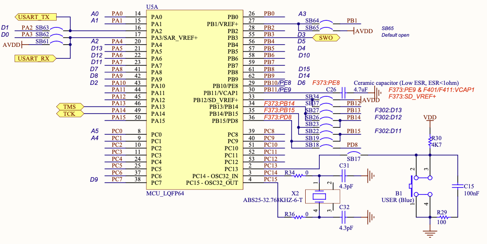
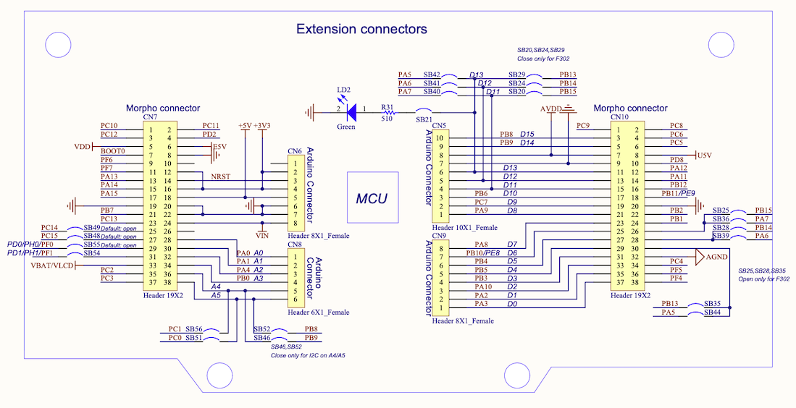
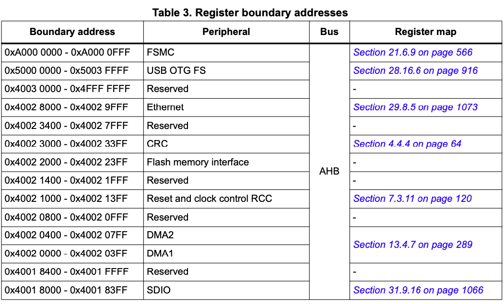
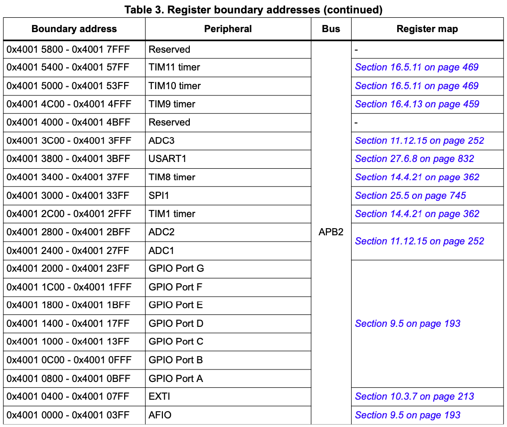
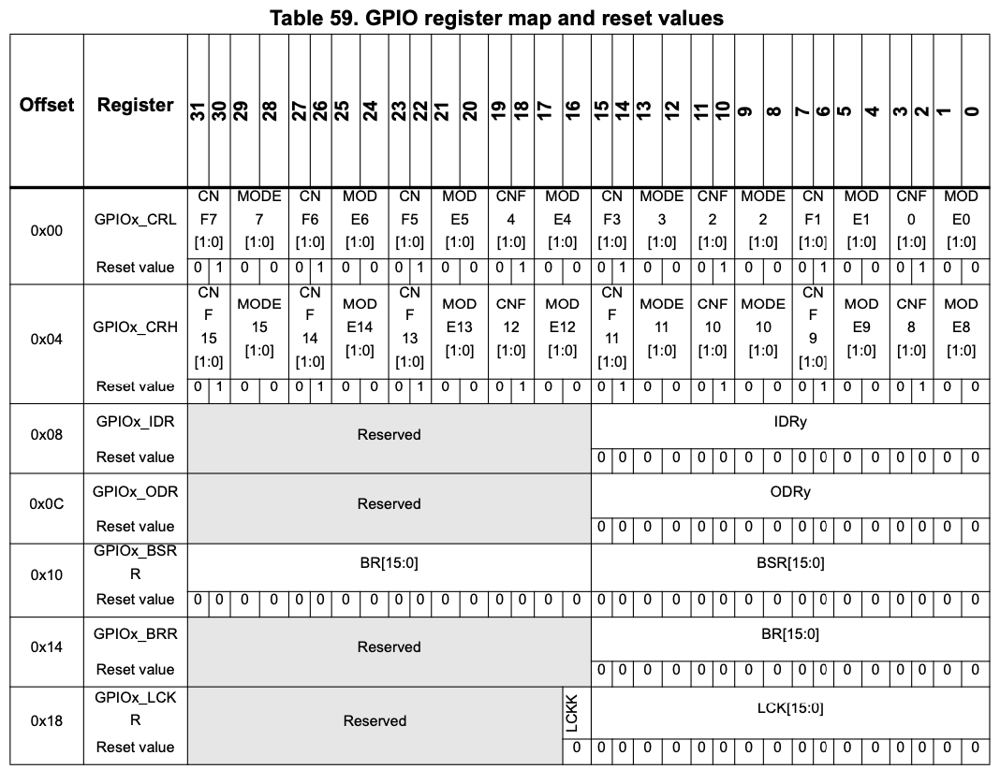

## ENSE 352 - Fundamentals of Computer Systems Architectures - Laboratory

# Lab 4: Introduction to GPIO

### University of Regina
### Faculty of Engineering and Applied Science - Software Systems Engineering

### Lab Instructor: [Trevor Douglas](mailto:trevor.douglas@uregina.ca)

## Objective

The objective of this lab is to introduce the students to general purpose I/O on the ARM Cortex M3 microcontroller.  

## Background

General Purpose Input/Output (GPIO) refers to the use of logic level pins on the microcontroller device to connect to user input and output devices. It is often referred to as parallel I/O since multiple inputs or outputs appear in common registers inside the device. Reading a group of switches may be as simple as reading the value contained in one device register and driving outputs might be as simple as writing values to corresponding device registers.

Typically to control hardware peripherals you must write to registers that provide information on how that peripheral is to behave. 

*** Do not get these confused with registers from the ARM core!! ***

In order to write to these registers you must know the address(where they live in address space)and most importantly what bits to write to these registers. To know this you must READ the documentation of the registers so you know how they work.

### Board Schematic

<table>
  <tr>
    <td> </td>
  </tr>
</table>

Notice from the above schematic that the USER Blue Switch is located on PC 13.  Look at the circuit that is connected to this pin.  How will the current flow when the switch is pressed?  Take note of this pin.

<table>
  <tr>
    <td> </td>
  </tr>
</table>
Notice from the above schematic that the Green LED is located on PA 5.  Look at the circuit that is connected to this pin.  How will the current flow here? Take note of this pin.

### Discovering Peripheral Addresses

Peripheral Addresses are given a Boundary Address and an offset. This allows peripherals to be moved to different Boundary locations and their documentation and code templates do not have to change that often.

From our STM32F10xxRefMaual-2.pdf documentation:

<table>
  <tr>
    <td> </td>
  </tr>
  <tr>
    <td> </td>
  </tr>
  <tr>
    <td> </td>
  </tr>
</table>

To Calculate the physical address you would add the boundary address + the offset.

So, now we have some information.  We know:
- Our LED is on PA 5.  That is Port A pin 5.
- Our blue button is on PC 13.  That is Port C pin 13.
- We know how to derive the addresses for the Ports we care about.
- From previous labs we know how to set and clear bits in registers.

In order to make the money we need to understand what registers to use and what bits we need to write to these registers.  Now we have to read the documentation.

### Port pins

Earlier in the semester we discussed one of the benefits of the ARM architecture and the STM32F103B mincrocontroller is the ability to dynamically control power to the peripherals.  In order to use these I/O lines you will need to first turn on the clocks for PORT A and PORT C.  Investigate the  APB2 peripheral clock enable register (RCC__APB2ENR)  in the Reference Manual. 

Now that you are providing a clocking source to your I/O lines you must configure the lines to support what is connected to them.  Look at GPIOx\textunderscore CRL.  Notice that we need to configure
Port A pin 5 as output, max speed 50MHz, general purpose output push-pull.  Notice that the CNF and MODE bits (4 bits in total) configure one I/O line.

PORT C pin 13 is connected to the blue button switch.  Look at  GPIOx\textunderscore CRH and configure the MODE bits to input and the CNF bits to floating input. 

Now that our port pins are configured, use GPIOx\textunderscore ODR to change the state of our output I/O pins and use GPIOx\textunderscore IDR to determine the state of our input I/O lines.

## Procedure

### Phase 1
The easiest way to begin is to setup the GPIO to turn on a led.  Looking at the board schematic, notice the port pins that the user LED's are attached to.  Using the information given in lab and class write an assembly routine to turn on one of the user LED's.  You have to configure the I/O lines first.  This should be done in a subroutine.

### Phase 2
Now that you can control the LED, write a routine to blink the LED.  HINT:  toggling an LED in code happens very quick!!  Use a delay routine to leave a LED on long enough to see it light up.  
At the end of this phase, have your code blinking the LED off and on in a loop for 10 times.

### Phase 3
Now write a routine such that when the user presses the button down, the LED will come on.  When the user releases the button the light will turn off.  This is called polling the state of the button.

